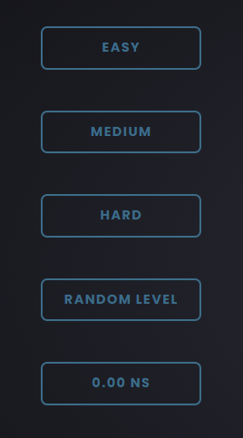
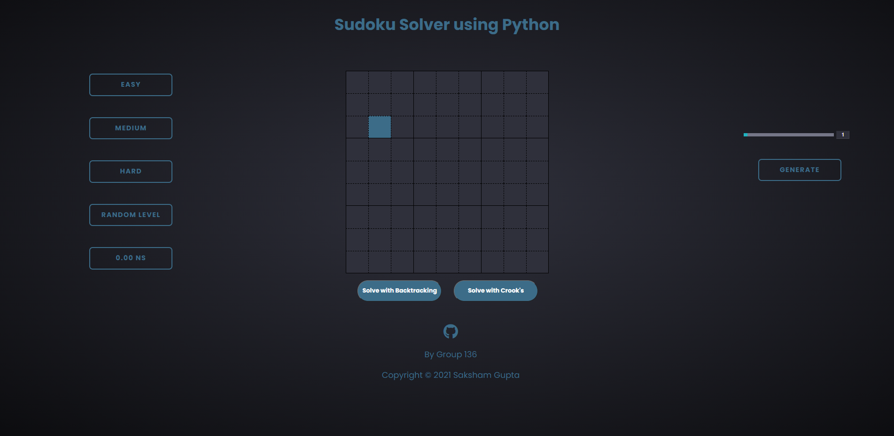
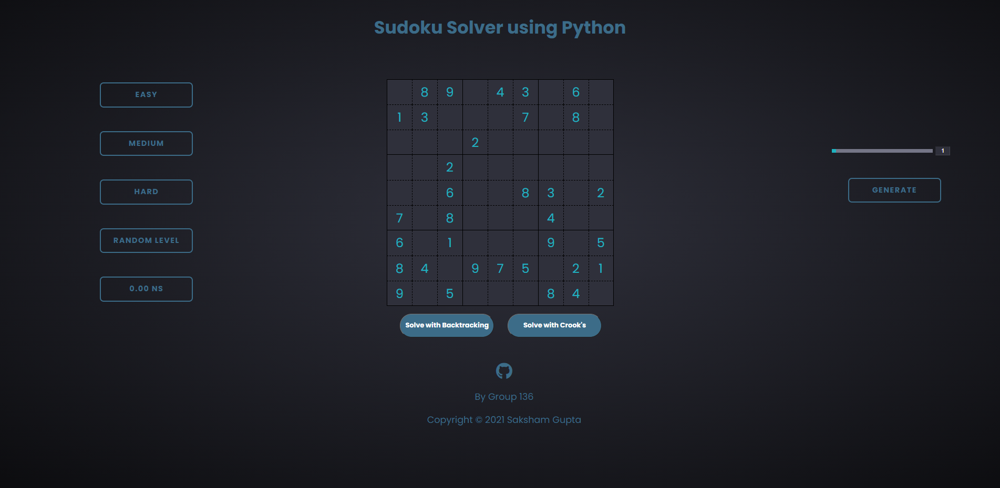
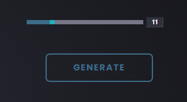
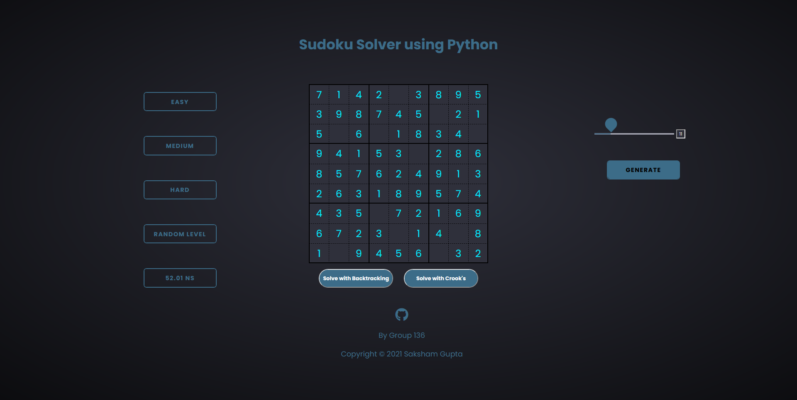
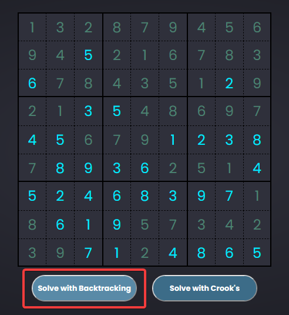
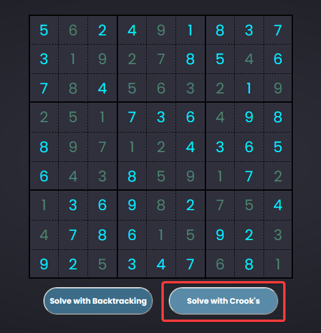
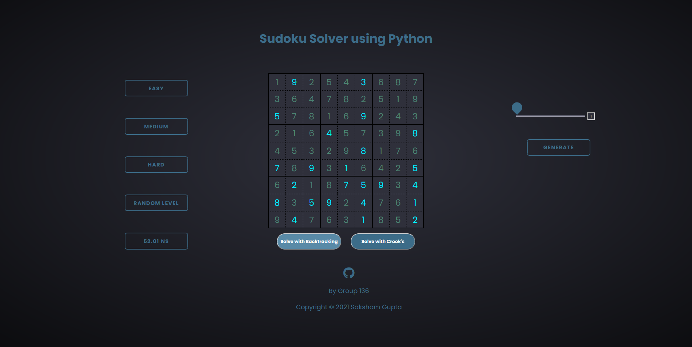

<div align="center">
  <br>
  
  <h1>🧩 Sudoku Generator and Solver 🧩</h1>
  <strong>Lets Make Sudoku Solving Easy</strong>
  <br></br>
  <a href="https://www.python.org/">
    	
  </a>
  <br></br>
  <p align="center">
	
  </p>
  <br></br>
</div>

# Sudoku Solver Web App

This Web App Automatically Generates Sudoku Puzzle Based on Various Difficulty Level, also Solves and Informs the Time Taken to Solve Them

### 🤔 For Live Example:
This will only generate Sudoku. You will have to run api.py file to solve the sudoku.

[Sudoku-Solver-Web-App](https://saksham20bce10288.github.io/Sudoku-Solver-Web-App/)

### 🚴‍♂️ How to run

- Install python and pip
- Run pip install -r requirements.txt
- Run python api.py
- Open index.html 

### 📐 Requirements:
In order to run the Script, the require **Flask and Flask_Cors** and you can install the requirements using:
```
pip install -r requirements.txt
```

### 🍀 Four Levels 

- Easy Level
- Medium Level
- Hard Level
- Random Level
- Time Measure by Algorithm to Solve the Puzzle

<p align="center">
  
</p>

### ➕ Intial View

<p align="center">
  
</p>

### 🧩 Generate the Puzzle

- After Clicking the Desired Level of Sudoku Puzzle, Wait for 1-2 Seconds for Sudoku Puzzle to Load

<p align="center">
  
</p>

- You can also Generate the Sudoku, with Required Number of Spaces using Slider to Generate Given on Right Side. For Eg. Take Spaces as '11'

<p align="center">
  
</p>

<p align="center">
  
</p>

### 🤔 Solve the Sudoku Puzzle

- Click on **Solve the Sudoku** Button

- Solved Using BackTracking Algorithm

<p align="center">
  
</p>

- Solved Using Crook's Algorithm

<p align="center">
  
</p>

- Final Solved View of Web App

<p align="center">
  
</p>

### 👨‍💻 Execution:
-	Clone this repository using
```
git clone https://github.com/Saksham20BCE10288/Sudoku-Solver-Web-App.git
```
**OR**
<br></br>
Zip Download the Repository and Extract it's contents.
-	Now run the [API](https://github.com/Saksham20BCE10288/Sudoku-Solver-Web-App/blob/master/api.py) file directly in your Terminal using
```
python api.py
```
**OR**
```
python3 api.py
```

<br></br>
<p align='center'><b>Made with ❤ by Saksham Gupta</b></p>
